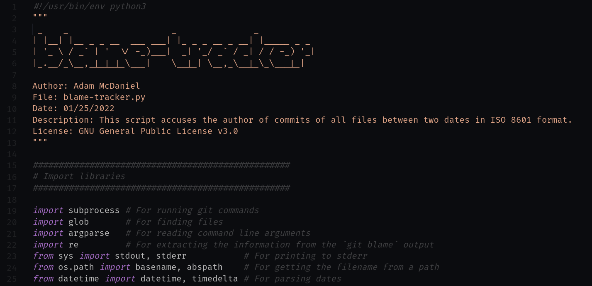
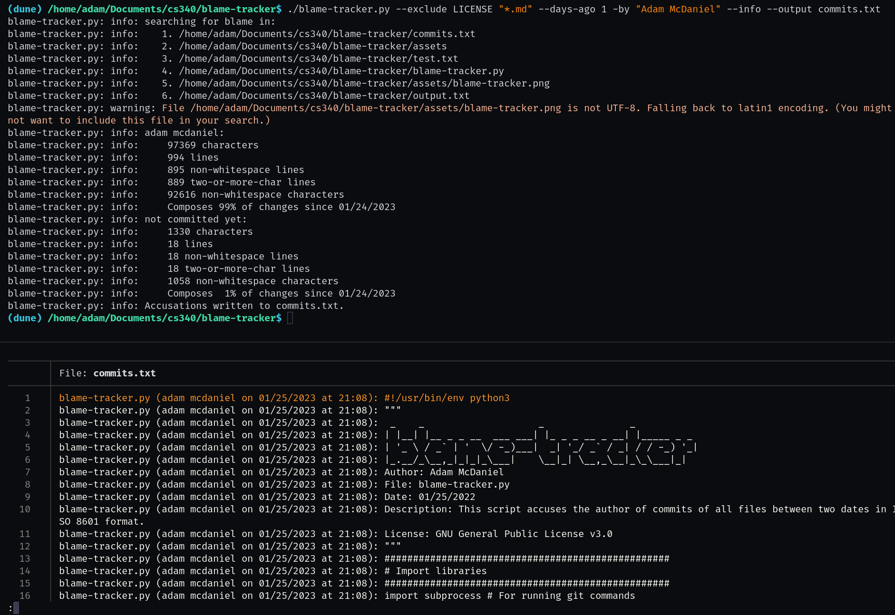

# blame-tracker.py
*Accuse guilty developers!*



[***Click here to go to the script!***](https://raw.githubusercontent.com/adam-mcdaniel/blame-tracker/main/blame-tracker.py)

## Usage

Blame-tracker has several flags, but there are only a few you need to know about:

### Important Flags

|Short|Long|Args|Description|
|-|-|-|-|
|`-i`|`--info`|❌|Print info messages about the statistics related to the commits.|
|`-d`|`--days-ago`|`int`|Set or shift the start date for the collection of commits back by a number of days.|
|`-t0`|`--since`|An American formatted date like `1/31/1970` (January 31st, 1970), or an [ISO 8601 formatted date](https://en.wikipedia.org/wiki/ISO_8601).|Set the start date for the collection of commits.|
|`-t1`|`--until`|👆|Set the end date for the collection of commits.|
|`-in`|`--include`|One or more more [file patterns](https://en.wikipedia.org/wiki/Glob_(programming)).|Include one or more patterns of files. To include all C files in a given folder, you could do `-in "folder/*.c"` (or `"folder/**/*.c"` for recursion)|
|`-ex`|`--exclude`|👆|Exclude one or more patterns of files. You can do this on your build folders `-ex build`, or all markdown files `-ex "**/*.md"`|
|`-by`|`--author`|One or more authors' names.|This will filter the annotated output to only show code by the authors supplied.|
|`-o`|`--output`|The output path for the accused lines of code.|This flag is optional. This writes the relevant, annotated code to the output file according to the filters provided in the arguments.|

### Less Important Flags

These are flags that you probably won't need to use, but they're here if you need them.

|Short|Long|Args|Description|
|-|-|-|-|
|`-f`|`--format`|A format string to print the accused code with.|The format arguments used are `name` (the name of the accused file), `path` (the path of the accused file), `author` (the author of the file), `content` (the line in the accusation), `date` (the date of the commit), and `time` (the time of the commit). The default format specifier is `"{name:12} ({author} on {date} at {time}): {content}"`|
|`-w`|`--weeks-ago`|`int`|Set or shift the start date for the collection of commits back by a number of weeks.|
|`-dir`|`--directory`|A path to a Git repository.|Set the directory of the git repository to accuse. By default this is just the current directory.|
|`-ws`|`--keep-whitespace`|❌|Use this flag to keep whitespace lines in the output file.|
|`-s`|`--silence-warnings`|❌|Use this flag to silence warnings. This will allow bytes-like data to be accused and included in the output file silently. Don't use this if you don't wanna include massive binary files (which you probably don't).|
|`-v`|`--verbose`|`1`, `2`, or `3`|Set the verbosity level for printing out runtime information. `1` is the same as enabling `--info`.|
|`-h`|`--help`|❌|Print the help message.|

### Examples



Here are some examples of how to use `blame-tracker.py`:

```bash
# Print the blame for all C files (recursively) in the current repository.
blame-tracker.py -in "**/*.c"
# Print the blame for all C files (recursively) in another given repository
blame-tracker.py -r /path/to/repo -in "**/*.c"
# Print the blame for all C files in a `src` repository and exclude all markdown files in the current directory
blame-tracker.py -in "src/*.c" -ex "*.md"
# Print the blame for a specific author in the current directory
blame-tracker.py -by "Adam McDaniel"
# Print the blame for a specific author in the current directory and include all rust files (recursively), excluding all files in the `target` directory
blame-tracker.py -by "Adam McDaniel" -in "**/*.rs" -ex "target"
# Print a formatted blame for a specific author in the current directory and include all rust files (recursively), excluding all files in the `target` directory
blame-tracker.py -by "Adam McDaniel" -in "**/*.rs" -ex "target" -f "{name:12} {date} ({author}) {content}"
# Get the blame for a specific author in the current directory and include all rust files (recursively), excluding all files in the `target` directory, and write it the output to a file
blame-tracker.py -by "Adam McDaniel" -in "**/*.rs" -ex "target" -o output.txt
```

## Installation

Requirements:
- Python 3.11
- Git

### As a Script

You can run `blame-tracker.py` as a script by running `python3 blame-tracker.py` in the directory of the repository you want to blame. You can also make it an executable with `chmod +x blame-tracker.py` and run it with `./blame-tracker.py`. You can also add the directory of the repository to your `PATH` environment variable to run it from anywhere. This is the easiest way to use `blame-tracker.py`, and is possible on all platforms (but on Windows it's a bit more tedious).

##### Simple Download and Run

This is just a simple two-liner to download and run the script. You can also download it with `git` if you prefer.

```bash
curl -L https://raw.githubusercontent.com/adam-mcdaniel/blame-tracker/main/blame-tracker.py -o blame-tracker.py
python3 blame-tracker.py --since "1/1/2023" -by "Adam McDaniel" -o "commits.txt"
```

##### Download with Git, Make Executable, and Run

Here's a simple snippet to download, make executable, and run the script.

```bash
## Download the script with git
git clone https://github.com/adam-mcdaniel/blame-tracker
cp blame-tracker/blame-tracker.py .
rm -rf blame-tracker
## (Or download the script with curl)
# curl -O https://raw.githubusercontent.com/adam-mcdaniel/blame-tracker/main/blame-tracker.py

## Make the script executable (optional)
chmod +x blame-tracker.py

## Run the script
python3 blame-tracker.py -h
# or
./blame-tracker.py -h
```

### \*nix Installation

You can install `blame-tracker.py` on Linux very simply by saving it to your `~/.local/bin` directory. You can do this by cloning the repository and copying the file over, or by using `curl` to download the file directly.

#### Through Curl

```bash
# If this directory doesn't exist, you can create it with `mkdir -p ~/.local/bin`, and add it to your PATH with `export PATH="$PATH:$HOME/.local/bin"` in your `.bashrc` or `.zshrc` file.
curl -L https://raw.githubusercontent.com/adam-mcdaniel/blame-tracker/main/blame-tracker.py -o ~/.local/bin/blame-tracker.py
chmod +x ~/.local/bin/blame-tracker.py

# Run the script
blame-tracker.py -h
```

#### Through Git

```bash
git clone https://github.com/adam-mcdaniel/blame-tracker
cd blame-tracker
chmod +x blame-tracker.py
# If this directory doesn't exist, you can create it with `mkdir -p ~/.local/bin`, and add it to your PATH with `export PATH="$PATH:$HOME/.local/bin"` in your `.bashrc` or `.zshrc` file.
cp blame-tracker.py ~/.local/bin/
cd ..
rm -rf ./blame-tracker

# Run the script
blame-tracker.py -h
```
